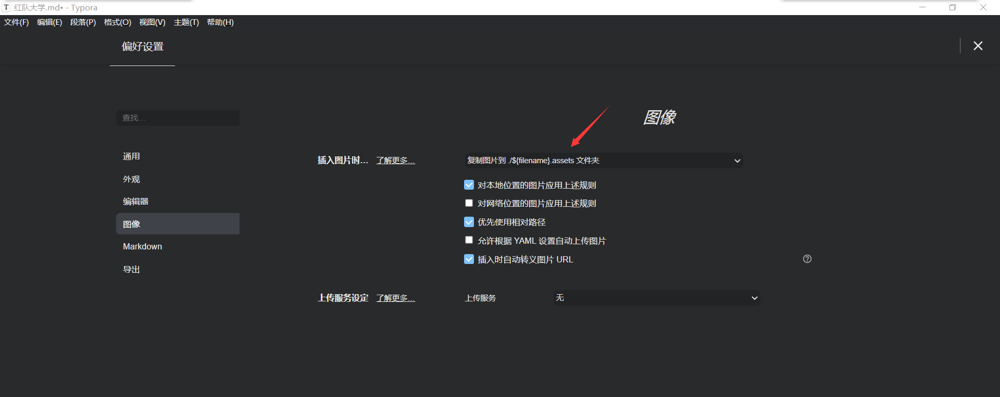
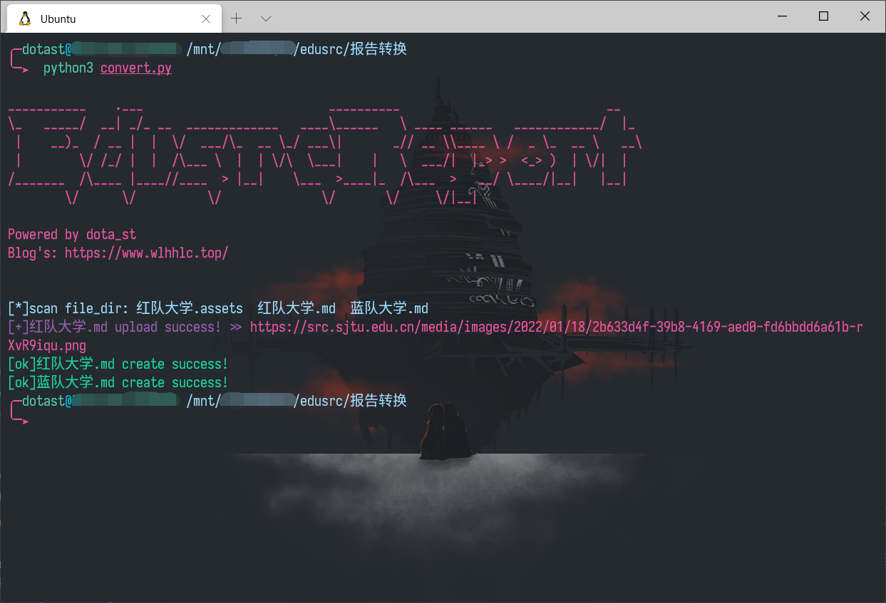

# EdusrcReport转换工具[✨](https://emojipedia.org/sparkles/)

## [💡](https://emojipedia.org/objects/)工具目的

- 解决在edusrc平台编写漏洞报告时经常上传图片名字乱码导致格式错误，不显示图片的困扰
- 提供给喜欢和我一样用md格式编写漏洞报告的师傅
- 专注于漏洞挖掘，减少报告格式与上传图片等问题带来的烦恼

##  [💖](https://emojipedia.org/sparkles/)使用

确保`convert.py`同级下有`old_file`和`new_file`两个文件夹

- `old_file`用于存放我们编写的原漏洞报告
- 运行后新的报告会生成到`new_file`文件夹下

**typora**请设置如下相对路径规则

设置`config.ini`里面的内容为自己账号的数据之后，运行`convert.py`

[✔️](https://emojipedia.org/check-mark/)支持批量转换

